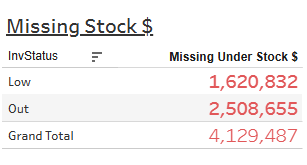

# Missing Stock


## Parameters

```code
Supported Parameters

ParamName: Inventory Class
ParamType: CHAR(2)
ParamDisplay: Checkbox List
ParamSQL:
SELECT CLASSNUM AS InvClass, CLASSNAME
FROM KMTDTA.CLASSES
WHERE ACTIVE = 'Y'
ORDER BY CLASSNUM
```

## SQL Statement

```sql
SELECT z.Description,
  -- With Formatting
  -- VARCHAR_FORMAT(CASE z.Description WHEN 'Low' THEN y.LowValue WHEN 'Out' THEN y.OutValue
  --   WHEN 'Grand Total' THEN y.LowValue+y.OutValue END
  --   ,'$999,999,999') AS OnHandValue
  
  -- Without Formatting
  CASE z.Description WHEN 'Low' THEN y.LowValue WHEN 'Out' THEN y.OutValue
    WHEN 'Grand Total' THEN y.LowValue+y.OutValue END AS OnHandValue  
FROM
  (SELECT 'Low' AS Description FROM SYSIBM.SYSDUMMY1 UNION ALL
   SELECT 'Out' AS Description FROM SYSIBM.SYSDUMMY1 UNION ALL
   SELECT 'Grand Total' AS Description FROM SYSIBM.SYSDUMMY1
  ) z
  CROSS JOIN
  (SELECT
     SUM(Low * (Cost + FET)) AS LowValue,
     SUM(Out * (Cost + FET)) AS OutValue
   FROM  
     (SELECT p.PDACTCOST AS Cost, p.PDFEDTAX AS FET,
        CASE WHEN p.PDINVENTRY > 0 AND p.PDINVENTRY < p.PDMIN THEN p.PDMIN - p.PDINVENTRY ELSE 0 END AS Low,
        CASE WHEN p.PDINVENTRY = 0 AND p.PDMIN > 0 THEN p.PDMIN ELSE 0 END AS Out
      FROM DTA273.TMPROD p
        LEFT JOIN KMTDTA.VENDORS v ON p.PDVENDOR = v.VENDNUM
      WHERE p.PDDELETE = 'A'
        AND p.PDCLASS IN ('14','15')
     ) x
   ) y
```

## Returned Dataset

```csv
"DESCRIPTION","ONHANDVALUE"
"Low","1476759.4300"
"Out","2675376.2700"
"Grand Total","4152135.7000"
```

## Output


