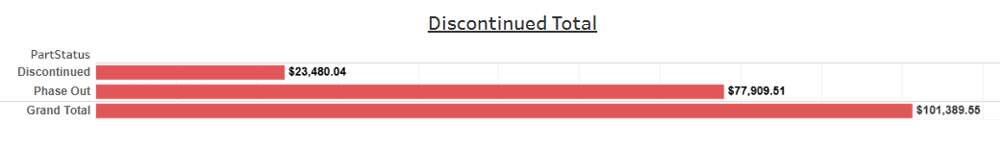

# Discontinued Total


## Parameters

```code
Supported Parameters

ParamName: Inventory Class
ParamType: CHAR(2)
ParamDisplay: Checkbox List
ParamSQL:
SELECT CLASSNUM AS InvClass, CLASSNAME
FROM KMTDTA.CLASSES
WHERE ACTIVE = 'Y'
ORDER BY CLASSNUM
```

## SQL Statement

```sql
SELECT y.Description,
    -- With Formatting
    -- VARCHAR_FORMAT(CASE y.Description WHEN 'Discontinued' THEN z.OHVDisc WHEN 'Phase Out' THEN z.OHVPhaseOut
    ---  WHEN 'Grand Total' THEN z.GrandTotal END, '$999,999,999.99') AS OnHandTotal
    -- Without Formatting  
    CASE y.Description WHEN 'Discontinued' THEN z.OHVDisc WHEN 'Phase Out' THEN z.OHVPhaseOut
      WHEN 'Grand Total' THEN z.GrandTotal END AS OnHandTotal  
FROM
  (SELECT 'Discontinued' AS Description FROM SYSIBM.SYSDUMMY1 UNION ALL
   SELECT 'Phase Out' AS Description FROM SYSIBM.SYSDUMMY1 UNION ALL
   SELECT 'Grand Total' AS Description FROM SYSIBM.SYSDUMMY1
  ) y
  CROSS JOIN
  (SELECT
    SUM(CASE WHEN LOCATE('*', TRIM(p.PDDESCRIP)) BETWEEN 1 AND LENGTH(TRIM(p.PDDESCRIP))-1
      THEN p.PDINVENTRY * (p.PDACTCOST + p.PDFEDTAX) ELSE 0 END) AS OHVDisc,
    SUM(CASE WHEN LOCATE('>', p.PDDESCRIP) > 0
      THEN p.PDINVENTRY * (p.PDACTCOST + p.PDFEDTAX) ELSE 0 END) AS OHVPhaseOut,
    SUM(CASE WHEN LOCATE('*', TRIM(p.PDDESCRIP)) BETWEEN 1 AND LENGTH(TRIM(p.PDDESCRIP))-1 OR LOCATE('>', p.PDDESCRIP) > 0
      THEN p.PDINVENTRY * (p.PDACTCOST + p.PDFEDTAX) ELSE 0 END) AS GrandTotal
   FROM DTA273.TMPROD p
     LEFT JOIN KMTDTA.VENDORS v ON p.PDVENDOR = v.VENDNUM
   WHERE p.PDDELETE = 'A'
     AND p.PDCLASS IN ('14','15')
  ) z
```

## Returned Dataset

```csv
"DESCRIPTION","ONHANDTOTAL"
"Discontinued","23261.9400"
"Phase Out","77610.7700"
"Grand Total","100872.7100"
```

## Output


