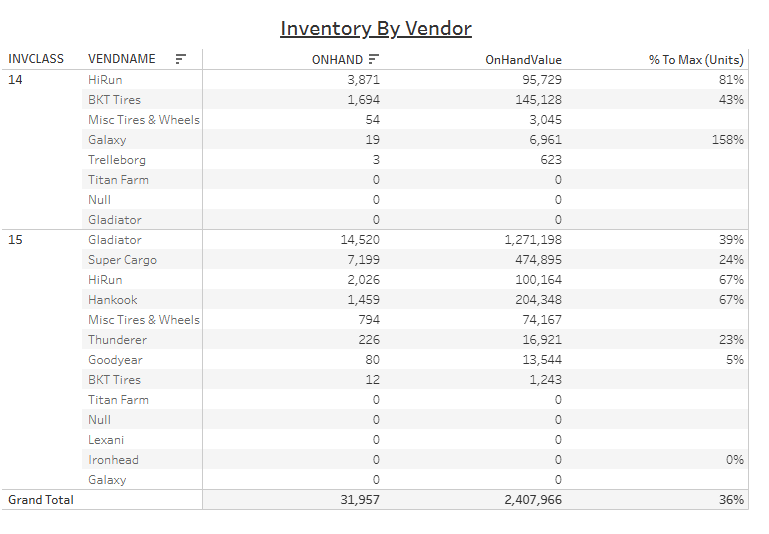

# Inventory By Vendor


## Parameters

```code
Supported Parameters

ParamName: Inventory Class
ParamType: CHAR(2)
ParamDisplay: Checkbox List
ParamSQL:
SELECT CLASSNUM AS InvClass, CLASSNAME
FROM KMTDTA.CLASSES
WHERE ACTIVE = 'Y'
ORDER BY CLASSNUM

ParamName: Vendor Number
ParamType: CHAR(3)
ParamDisplay:  Checkbox List
ParamSQL:
SELECT VENDNUM, VENDNAME
FROM KMTDTA.VENDORS
ORDER BY VENDNAME
```

## SQL Statement

```sql
SELECT InvClass, TRIM(VendorName) AS VendorName,
  -- With Formatting
  -- VARCHAR_FORMAT(SUM(OnHand),'999,999,999') AS OnHand,
  -- VARCHAR_FORMAT(SUM(OnHand * (Cost + FET)),'$999,999,999') AS OnHandValue,
  -- VARCHAR_FORMAT(CAST(SUM(OnHand) AS DECIMAL(10,2)) / SUM(Max) * 100,'999') || '%' AS "%ToMaxUnits"
  
  -- Without Formatting
  SUM(OnHand) AS OnHand,
  SUM(OnHand * (Cost + FET)) AS OnHandValue,
  CAST(CAST(SUM(OnHand) AS DECIMAL(10,2)) / SUM(Max) * 100 AS DECIMAL(10,2)) AS "%ToMaxUnits"
  
FROM  
  (SELECT p.PDCLASS AS InvClass, v.VENDNAME AS VendorName, v.VENDNUM AS VendorNumber, p.PDACTCOST AS Cost,
     p.PDFEDTAX AS FET, p.PDMAX AS Max, CAST(p.PDINVENTRY AS DECIMAL(10,2)) AS OnHand
   FROM DTA273.TMPROD p
     LEFT JOIN KMTDTA.VENDORS v ON p.PDVENDOR = v.VENDNUM
   WHERE p.PDDELETE = 'A'
     AND p.PDCLASS IN ('14','15')
     AND p.PDVENDOR IN (111,134,149,150,159,171,180,183,212,217,221,223,852)
     -- BKT Tires-180, Galaxy-183, Gladiator-171, Goodyear-150, Hankook-111, HiRun-223, Ironhead-221, Lexani-212, Misc Tires + Wheels-852, Super Cargo-159, Thunderer-217, Titan Farm-149, Trelleborg-134
  ) z
GROUP BY InvClass, VendorName
-- HAVING SUM(OnHand) > 0
ORDER BY InvClass, OnHand DESC, VendorName
```

## Returned Dataset

```csv
"INVCLASS","VENDORNAME","ONHAND","ONHANDVALUE","%ToMaxUnits"
"14","HiRun","4005.00","98566.8200","83.61"
"14","BKT Tires","1932.00","160941.4900","48.88"
"14","Misc Tires & Wheels","50.00","2779.7100",""
"14","Galaxy","19.00","6961.1800","158.33"
"14","Trelleborg","3.00","623.2500",""
"14","Gladiator","0.00","0.0000",""
"14","Titan Farm","0.00","0.0000",""
"15","Gladiator","14202.00","1234567.0700","38.31"
"15","Super Cargo","6942.00","458050.8800","23.21"
"15","HiRun","2071.00","100887.3100","68.98"
"15","Hankook","1507.00","211472.4400","69.51"
"15","Misc Tires & Wheels","793.00","74133.7500",""
"15","Thunderer","228.00","17070.3600","22.80"
"15","Goodyear","76.00","13054.6300","4.48"
"15","BKT Tires","12.00","1242.9600",""
"15","Ironhead","1.00","103.9400","0.01"
"15","Galaxy","0.00","0.0000",""
"15","Lexani","0.00","0.0000",""
"15","Titan Farm","0.00","0.0000",""
```

## Output


