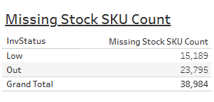

# Missing Stock SKU Count


## Parameters

```code
Supported Parameters

ParamName: Inventory Class
ParamType: CHAR(2)
ParamDisplay: Checkbox List
ParamSQL:
SELECT CLASSNUM AS InvClass, CLASSNAME
FROM KMTDTA.CLASSES
WHERE ACTIVE = 'Y'
ORDER BY CLASSNUM

ParamName: Vendor Number
ParamType: CHAR(3)
ParamDisplay: Checkbox List
ParamSQL:
SELECT VENDNUM, VENDNAME
FROM KMTDTA.VENDORS
ORDER BY VENDNAME

ParamName: Store Number
ParamType: DECIMAL(3,0)
ParamDisplay: Checkbox List
ParamSQL:
SELECT STORENUM, STORENAME
FROM KMTDTA.STORES
WHERE ACTIVE = 'Y'
ORDER BY STORENAME
```

## SQL Statement

```sql
SELECT z.Description,
  -- With Formatting
  -- VARCHAR_FORMAT(CASE z.Description WHEN 'Low' THEN y.Low WHEN 'Out' THEN y.Out
  --   WHEN 'Grand Total' THEN y.Low+y.Out END
  -- ,'999,999,999') AS "Missing Stock SKU Count"
  
  -- Without Formatting
  CASE z.Description WHEN 'Low' THEN y.Low WHEN 'Out' THEN y.Out
    WHEN 'Grand Total' THEN y.Low+y.Out END AS "Missing Stock SKU Count"

FROM
  (SELECT 'Low' AS Description FROM SYSIBM.SYSDUMMY1 UNION ALL
   SELECT 'Out' AS Description FROM SYSIBM.SYSDUMMY1 UNION ALL
   SELECT 'Grand Total' AS Description FROM SYSIBM.SYSDUMMY1
  ) z
  CROSS JOIN
  (SELECT SUM(Low) AS Low, SUM(Out) AS Out
   FROM  
     (SELECT p.PDSTORE AS Store, p.PDVENDOR, p.PDACTCOST AS Cost, p.PDFEDTAX AS FET,
        CASE WHEN p.PDINVENTRY > 0 AND p.PDINVENTRY < p.PDMIN THEN p.PDMIN - p.PDINVENTRY ELSE 0 END AS Low,
        CASE WHEN p.PDINVENTRY = 0 AND p.PDMIN > 0 THEN p.PDMIN ELSE 0 END AS Out
      FROM DTA273.TMPROD p
        LEFT JOIN KMTDTA.VENDORS v ON p.PDVENDOR = v.VENDNUM
      WHERE p.PDDELETE = 'A'
        AND p.PDCLASS IN ('14','15')
        AND p.PDSTORE IN (1,2,3,4,6,7,15,18,22,23,24,25,27,31,33,42,43,47,49,50,51,52,53,55,57,59,64,80,82,83,84,86,88)
        AND (p.PDVENDOR IS NULL OR TRIM(p.PDVENDOR) = '' OR p.PDVENDOR IN (111,150,159,171,180,217,223))
        -- BKT Tires-180, Gladiator-171, Goodyear-150, Hankook-111, HiRun-223, Super Cargo-159, Thunderer-217
     ) x
  ) y
```

## Returned Dataset

```csv
"DESCRIPTION","ONHANDVALUE"
"Low","1476759.4300"
"Out","2675376.2700"
"Grand Total","4152135.7000"
```

## Output


