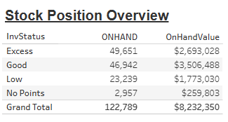

# Stock Position Overview


## Parameters

```code
Supported Parameters

ParamName: Inventory Class
ParamType: CHAR(2)
ParamDisplay: Checkbox List
ParamSQL:
SELECT CLASSNUM AS InvClass, CLASSNAME
FROM KMTDTA.CLASSES
WHERE ACTIVE = 'Y'
ORDER BY CLASSNUM
```

## SQL Statement

```sql
SELECT z.Description,
  -- With Formatting
/*  
  VARCHAR_FORMAT(CASE z.Description WHEN 'Excess' THEN y.ExcessOnHand WHEN 'Good' THEN y.GoodOnHand
    WHEN 'Low' THEN y.LowOnHand WHEN 'No Points' THEN y.NoPointsOnHand
    WHEN 'Grand Total' THEN y.ExcessOnHand+y.GoodOnHand+y.LowOnHand+y.NoPointsOnHand END
  ,'999,999,999') AS OnHand,
  VARCHAR_FORMAT(CASE z.Description WHEN 'Excess' THEN y.ExcessValue WHEN 'Good' THEN y.GoodValue WHEN 'Low' THEN y.LowValue
    WHEN 'No Points' THEN y.NoPointsValue
    WHEN 'Grand Total' THEN y.ExcessValue+y.GoodValue+y.LowValue+y.NoPointsValue END
  ,'$999,999,999') AS OnHandValue
*/  
  -- Without Formatting
  CASE z.Description WHEN 'Excess' THEN y.ExcessOnHand WHEN 'Good' THEN y.GoodOnHand
    WHEN 'Low' THEN y.LowOnHand WHEN 'No Points' THEN y.NoPointsOnHand
    WHEN 'Grand Total' THEN y.ExcessOnHand+y.GoodOnHand+y.LowOnHand+y.NoPointsOnHand END AS OnHand,
  CASE z.Description WHEN 'Excess' THEN y.ExcessValue WHEN 'Good' THEN y.GoodValue WHEN 'Low' THEN y.LowValue
    WHEN 'No Points' THEN y.NoPointsValue
    WHEN 'Grand Total' THEN y.ExcessValue+y.GoodValue+y.LowValue+y.NoPointsValue END AS OnHandValue
  
FROM
  (SELECT 'Excess' AS Description FROM SYSIBM.SYSDUMMY1 UNION ALL
   SELECT 'Good' AS Description FROM SYSIBM.SYSDUMMY1 UNION ALL
   SELECT 'Low' AS Description FROM SYSIBM.SYSDUMMY1 UNION ALL
   SELECT 'No Points' AS Description FROM SYSIBM.SYSDUMMY1 UNION ALL
   SELECT 'Grand Total' AS Description FROM SYSIBM.SYSDUMMY1
  ) z
  CROSS JOIN
  (SELECT
     SUM(Excess) AS ExcessOnHand, SUM(Excess * (Cost + FET)) AS ExcessValue,
     SUM(Good) AS GoodOnHand, SUM(Good * (Cost + FET)) AS GoodValue,
     SUM(Low) AS LowOnHand, SUM(Low * (Cost + FET)) AS LowValue,
     SUM(NoPoints) AS NoPointsOnHand, SUM(NoPoints * (Cost + FET)) AS NoPointsValue
   FROM  
     (SELECT p.PDACTCOST AS Cost, p.PDFEDTAX AS FET,
        CASE WHEN p.PDINVENTRY >= (p.PDMAX * 1.5) AND p.PDMAX > 0 THEN p.PDINVENTRY ELSE 0 END AS Excess,
        CASE WHEN p.PDINVENTRY >= p.PDMIN AND p.PDINVENTRY < (p.PDMAX * 1.5) THEN p.PDINVENTRY ELSE 0 END AS Good,
        CASE WHEN p.PDINVENTRY > 0 AND p.PDINVENTRY < p.PDMIN THEN p.PDINVENTRY ELSE 0 END AS Low,
        CASE WHEN p.PDMIN = 0 THEN p.PDINVENTRY ELSE 0 END AS NoPoints
      FROM DTA273.TMPROD p
        LEFT JOIN KMTDTA.VENDORS v ON p.PDVENDOR = v.VENDNUM
      WHERE p.PDDELETE = 'A'
        AND p.PDCLASS IN ('14','15')
     ) x
   ) y
```

## Returned Dataset

```csv
"DESCRIPTION","ONHAND","ONHANDVALUE"
"Excess","49430.00","2679161.4700"
"Good","46069.00","3407750.1000"
"Low","24154.00","1852206.9900"
"No Points","2935.00","257782.7100"
"Grand Total","122588.00","8196901.2700"
```

## Output


