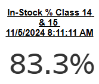

# Vendor In Stock 14 15


## Parameters

```code
Supported Parameters

ParamName: Inventory Class
ParamType: CHAR(2)
ParamDisplay: Checkbox List
ParamSQL:
SELECT CLASSNUM AS InvClass, CLASSNAME
FROM KMTDTA.CLASSES
WHERE ACTIVE = 'Y'
ORDER BY CLASSNUM

ParamName: Vendor Number
ParamType: CHAR(3)
ParamDisplay: Checkbox List
ParamSQL:
SELECT VENDNUM, VENDNAME
FROM KMTDTA.VENDORS
ORDER BY VENDNAME
```

## SQL Statement

```sql
SELECT 'In-Stock % Class 14 & 15 As Of: ' || VARCHAR_FORMAT(current_timestamp, 'MM/DD/YYYY HH:MM:SS AM') as Description,
  -- With Formatting
  -- VARCHAR_FORMAT((1 - (SUM(OutOfStockNow) / SUM(CAST(TotalToStock AS DECIMAL(10,2))))) * 100,'999.9') || '%' AS "%SKUInStock"
  
  -- Without Formatting
  (1 - (SUM(OutOfStockNow) / SUM(CAST(TotalToStock AS DECIMAL(10,2))))) * 100 AS "%SKUInStock"
FROM  
  (SELECT CASE WHEN p.PDMIN > 0 AND p.PDINVENTRY = 0 THEN 1 ELSE 0 END AS OutOfStockNow,
     CASE WHEN p.PDMIN > 0 THEN 1 ELSE 0 END AS TotalToStock
   FROM DTA273.TMPROD p
     LEFT JOIN KMTDTA.VENDORS v ON p.PDVENDOR = v.VENDNUM
   WHERE p.PDDELETE = 'A'
     AND p.PDCLASS IN ('14','15')
     AND p.PDVENDOR IN ('101','102','103','104','105','106','108','111','112','113','114','115','116','117',
       '118','120','121','122','124','125','127','128','129','130','132','133','134','135','136','141','142',
       '147','148','149','150','151','152','153','154','158','159','160','161','162','165','167','170','171',
       '172','173','174','178','179','180','182','183','184','188','189','192','193','194','196','198','199',
       '200','201','202','203','204','205','206','207','208','209','210','211','212','213','214','217','218',
       '220','221','223','225','226','230','232','249','291','292','325','502','503','850','852')
  ) z

```

## Returned Dataset

```csv
"DESCRIPTION","%SKUInStock"
"In-Stock % Class 14 & 15 As Of: 11/06/2024 02:11:09 PM","83.454591068740592100"
```

## Output


