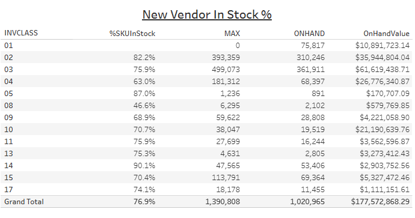

# Vendor In Stock


## Parameters

```code
Supported Parameters

ParamName: Inventory Class
ParamType: CHAR(2)
ParamDisplay: Checkbox List
ParamSQL:
SELECT CLASSNUM AS InvClass, CLASSNAME
FROM KMTDTA.CLASSES
WHERE ACTIVE = 'Y'
ORDER BY CLASSNUM

ParamName: Vendor Number
ParamType: CHAR(3)
ParamDisplay: Checkbox List
ParamSQL:
SELECT VENDNUM, VENDNAME
FROM KMTDTA.VENDORS
ORDER BY VENDNAME
```

## SQL Statement

```sql
SELECT InvClass,
  -- With Formatting
/*  
  VARCHAR_FORMAT((1 - (SUM(OutOfStockNow) / (CAST(SUM(TotalToStock) AS DECIMAL(10,2))))) * 100,'999.9') || '%' AS "%SKUInStock",
  VARCHAR_FORMAT(SUM(Max),'999,999,999') AS MAX,
  VARCHAR_FORMAT(SUM(OnHand),'999,999,999') AS OnHand,
  VARCHAR_FORMAT(SUM(OnHand * (Cost + FET)),'$999,999,999.99') AS OnHandValue
*/
  -- Without Formatting
  (1 - (SUM(OutOfStockNow) / (CAST(SUM(TotalToStock) AS DECIMAL(10,2))))) * 100 AS "%SKUInStock",
  SUM(Max) AS MAX,
  SUM(OnHand) AS OnHand,
  SUM(OnHand * (Cost + FET)) AS OnHandValue
  
FROM  
  (SELECT p.PDCLASS AS InvClass, p.PDACTCOST AS Cost, p.PDFEDTAX AS FET, p.PDMAX AS Max, p.PDMIN AS Min,
     p.PDINVENTRY AS OnHand, CASE WHEN p.PDMIN > 0 AND p.PDINVENTRY = 0 THEN 1 ELSE 0 END AS OutOfStockNow,
     CASE WHEN p.PDMIN > 0 THEN 1 ELSE 0 END AS TotalToStock
   FROM DTA273.TMPROD p
     LEFT JOIN KMTDTA.VENDORS v ON p.PDVENDOR = v.VENDNUM
   WHERE p.PDDELETE = 'A'
     AND p.PDCLASS IN ('01','02','03','04','05','08','09','10','11','13','14','15','17')
     AND p.PDVENDOR IN ('101','102','103','104','105','106','108','111','112','113','114','115','116','117',
       '118','120','121','122','124','125','127','128','129','130','132','133','134','135','136','141','142',
       '147','148','149','150','151','152','153','154','158','159','160','161','162','165','167','170','171',
       '172','173','174','178','179','180','182','183','184','188','189','192','193','194','196','198','199',
       '200','201','202','203','204','205','206','207','208','209','210','211','212','213','214','217','218',
       '220','221','223','225','226','230','232','249','291','292','325','502','503','850','852')
  ) z
GROUP BY InvClass
ORDER BY InvClass
```

## Returned Dataset

```csv
"INVCLASS","%SKUInStock","MAX","ONHAND","ONHANDVALUE"
"01","","0.00","75115.00","10792503.7900"
"02","82.196112773358632000","393359.00","310235.00","35878140.6300"
"03","75.838175638636114500","499073.00","359246.00","61152118.2600"
"04","63.010752688172043100","181156.00","68990.00","26859541.7300"
"05","87.022900763358778700","1236.00","882.00","168257.0400"
"08","47.087378640776699100","6295.00","2195.00","601875.9000"
"09","70.000000000000000000","59592.00","29593.00","4324577.5300"
"10","72.021474292793722900","38047.00","19897.00","21572068.5300"
"11","76.645112209965766500","27699.00","16257.00","3555479.0500"
"13","76.329787234042553200","4631.00","2877.00","3332982.4500"
"14","90.436949022614028400","47565.00","53698.00","2916278.6400"
"15","70.225127087872186000","113791.00","68871.00","5279498.1200"
"17","72.869955156950672700","18178.00","11186.00","1084019.3900"
```

## Output


